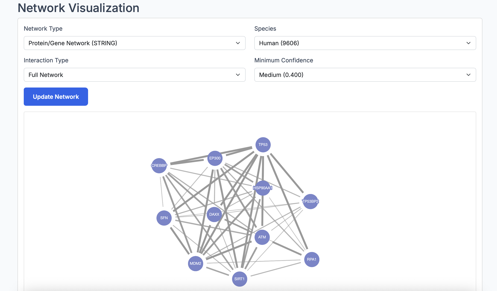
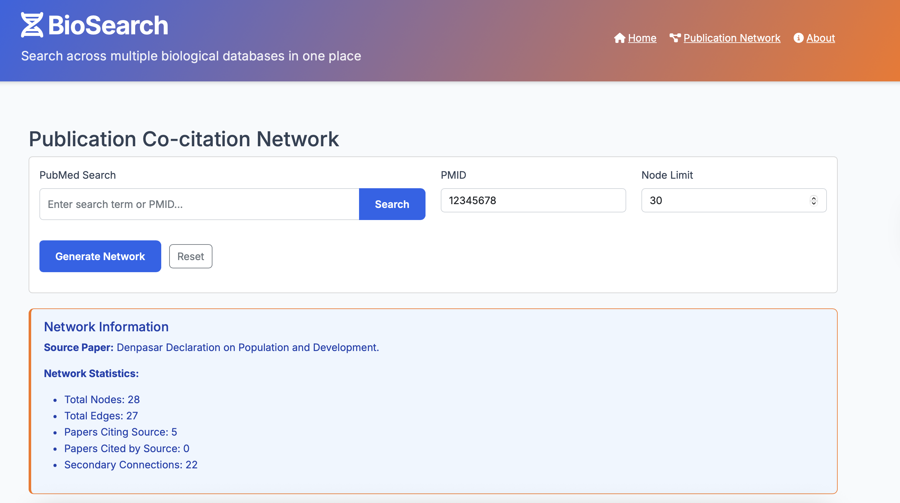
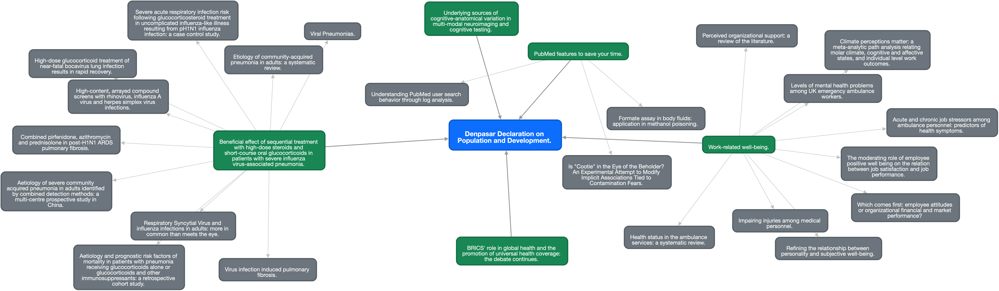

# BioSearch

BioSearch is a comprehensive biological database search system that integrates multiple biological databases containing pathway and protein information in humans and related organisms.


## Features

### Database Integration
BioSearch seamlessly connects to multiple biological databases:
- **NCBI (Entrez)**: Gene and protein data
- **PubMed**: Scientific literature
- **UniProt**: Protein sequences and annotations
- **DrugBank**: Drug information
- **KEGG**: Pathway data
- **PDB**: Protein structures
- **Ensembl**: Genomic information

### Core Functionality
- **Unified Search Interface**: Search across multiple databases with a single query
- **Rich Data Models**: Standardized representation of genes, proteins, pathways, and more
- **Flexible Search**:
  - Boolean operators (AND, OR, NOT)
  - Organism filtering
  - Date range filtering
- **Caching**: Efficient storage and retrieval of results using Redis
- **Web and CLI Interfaces**: Access via browser or command line
- **RESTful API**: Programmatic access for integration with other tools

### Advanced Network Visualization
- **Protein Interaction Networks**: Visualize protein-protein interactions from STRING/STITCH databases
  - Interactive node exploration
  - Configurable interaction confidence scores
  - Detailed protein information panels
  - Network export functionality
  
  

- **Publication Co-citation Networks**: Explore relationships between scientific papers
  - Visualize citation networks based on PubMed data
  - Identify influential papers in research fields
  - Interactive paper details and metadata
  - Discover research trends and connections
  
  
  

## Technologies Used

BioSearch is built with the following technologies:

### Backend
- **Python 3.9+**: Core programming language
- **Flask**: Web application framework
- **Aiohttp**: Asynchronous HTTP client/server for API requests
- **Redis**: Optional caching layer for improved performance

### Frontend
- **HTML5/CSS3**: Modern, responsive web interface
- **JavaScript**: Dynamic content and asynchronous requests
- **Bootstrap**: UI framework for responsive design
- **Cytoscape.js**: Graph visualization library for network displays

### Data Processing
- **Biopython**: Biological computation library
- **Pandas**: Data manipulation and analysis
- **NetworkX**: Network data structures for relationship mapping

### CLI Tools
- **Rich**: Terminal styling and formatting
- **Tabulate**: Table generation for command-line output

## Architecture

BioSearch follows a modular architecture:

```
BioSearch/
├── api/               # Database API modules
│   ├── db_config.py   # Database configurations
│   ├── db_helpers.py  # Common helpers for API access
│   ├── models.py      # Data models
│   ├── cache.py       # Caching functionality
│   ├── search_engine.py # Unified search logic
│   └── [db_modules]   # Database-specific modules
├── static/            # Frontend assets
│   ├── css/           # Stylesheets
│   ├── js/            # JavaScript
│   └── img/           # Images
├── templates/         # HTML templates
├── app.py             # Main Flask application
├── cli.py             # Command-line interface
└── requirements.txt   # Dependencies
```

## Getting Started

### Prerequisites
- Python 3.9+
- Git
- Redis (optional, for caching)

### Installation

1. Clone the repository:
```bash
git clone https://github.com/ErfanZohrabi/biosearch.git
cd biosearch
```

2. Create a virtual environment and activate it:
```bash
# Windows
python -m venv venv
venv\Scripts\activate

# macOS/Linux
python -m venv venv
source venv/bin/activate
```

3. Install the required dependencies:
```bash
pip install -r requirements.txt
```

4. Set up environment variables (optional):
```bash
# Create .env file
touch .env  # On Windows: type nul > .env

# Add API keys for better rate limits
echo "NCBI_API_KEY=your_ncbi_api_key" >> .env
```

### Running the Web Interface

```bash
cd Bio_search
python app.py
```

Then open your browser and navigate to `http://localhost:5000`.

### Using the Advanced Network Features

#### Protein Interaction Networks
1. Search for a protein (e.g., P04637 for TP53)
2. Select the protein from search results
3. Click "View Network" to visualize protein-protein interactions
4. Explore the network by clicking on nodes to see details
5. Adjust visualization settings using the control panel

#### Publication Co-citation Networks
1. Navigate to the Publication Network page
2. Enter a PMID (e.g., 12345678) or a search term
3. Click "Generate Network" to visualize the citation relationships
4. Explore papers that cite or are cited by the source paper
5. Click on nodes to view publication details and navigate between related papers

### Using the CLI

The BioSearch CLI provides a convenient way to search databases from the command line:

```bash
# Basic search
python cli.py "TP53"

# Search specific databases
python cli.py "insulin" -d uniprot,drugbank

# Specify organism
python cli.py "BRCA1" -o human -d ncbi,ensembl

# Export to JSON
python cli.py "apoptosis" -d pubmed,kegg -f json --output results.json
```

#### CLI Options

```
usage: cli.py [-h] [-d DATABASES] [-o ORGANISM] [-l LIMIT] [-f {table,json,csv}]
              [--from DATE_FROM] [--to DATE_TO] [-t TYPE] [--output OUTPUT]
              [--server URL] query

positional arguments:
  query                 Search query (e.g., gene name, protein, drug name)

optional arguments:
  -h, --help            show this help message and exit
  -d DATABASES, --databases DATABASES
                        Comma-separated list of databases to search (default: all)
  -o ORGANISM, --organism ORGANISM
                        Filter results by organism (default: human)
  -l LIMIT, --limit LIMIT
                        Maximum number of results per database (default: 5)
  -f {table,json,csv}, --format {table,json,csv}
                        Output format (default: table)
  --from DATE_FROM      Filter results from this date (YYYY-MM-DD)
  --to DATE_TO          Filter results until this date (YYYY-MM-DD)
  -t TYPE, --type TYPE  Filter by result type (e.g., gene, protein, pathway)
  --output OUTPUT       Save results to file (specify file path)
  --server URL          Use running BioSearch server at URL instead of direct API calls
```

## Deployment

BioSearch can be easily deployed to cloud platforms. The repository includes configuration for automatic deployment.

### Deploying to Render.com

The project includes a `render.yaml` file that configures the deployment for [Render.com](https://render.com/):

1. Create an account on Render.com if you haven't already
2. Fork this repository to your GitHub account
3. In Render.com, click "New" and select "Blueprint" from the dropdown menu
4. Connect your GitHub account and select the forked repository
5. Render will automatically detect the `render.yaml` file and set up the application
6. Set the following environment variables in the Render dashboard:
   - `FLASK_ENV`: production
   - `NCBI_API_KEY`: Your NCBI API key (optional, but recommended)
   - Any other API keys or configuration variables

### Automatic Deployment with GitHub Actions

The repository includes GitHub Actions workflows that automate deployment:

1. **Deploy to Render**: When you push to the main branch, the application is automatically deployed to Render.com.
   - Setup required: Add the following secrets to your GitHub repository settings:
     - `RENDER_SERVICE_ID`: Your Render service ID (found in the Render dashboard)
     - `RENDER_API_KEY`: Your Render API key (generated in your Render account settings)

2. **Deploy Documentation**: The project documentation is automatically published to GitHub Pages.
   - This creates a static website from your README.md and any documentation in the `/docs` folder
   - The documentation site will be available at `https://[your-username].github.io/biosearch/`

### Deploying Manually

If you prefer to deploy manually or to a different platform:

```bash
# Build and run with gunicorn (production server)
pip install gunicorn
gunicorn wsgi:app

# Or with specific host and port
gunicorn --bind 0.0.0.0:8000 wsgi:app
```

### Troubleshooting Deployment

If you encounter issues during deployment:

1. **Database API Errors**: Ensure all required API keys are set in environment variables
2. **Connection Timeouts**: Some public APIs have rate limits; consider implementing more aggressive caching
3. **Memory Issues**: Adjust the resource allocation in your hosting platform if needed

Remember that the web application requires a Python runtime environment and cannot be deployed to static hosting services like GitHub Pages directly.

## API Usage

BioSearch provides a RESTful API for programmatic access:

```python
import requests
import json

# Search for TP53 in NCBI and Ensembl
response = requests.get(
    'http://localhost:5000/api/search',
    params={
        'query': 'TP53',
        'databases': 'ncbi,ensembl',
        'organism': 'human',
        'limit': 5
    }
)

results = response.json()
print(json.dumps(results, indent=2))

# Get protein interaction network data
network_response = requests.get(
    'http://localhost:5000/api/network/string-data',
    params={
        'identifiers': 'P04637',
        'species': '9606',
        'score': 0.4
    }
)

network_data = network_response.json()
```

For detailed API documentation, visit `http://localhost:5000/api_docs` when the server is running.

## Data Model

BioSearch uses a standardized data model to represent biological entities:

- **Gene**: Genomic information, including location, expression, and variants
- **Protein**: Sequence, structure, function, and interactions
- **Pathway**: Components, interactions, and organism-specific information
- **Drug**: Chemical information, targets, and mechanisms of action
- **Publication**: Literature references
- **Structure**: Protein 3D structural information
- **Network**: Relationship data for visualizing connections between entities

## Extending BioSearch

### Adding a New Database

1. Create a configuration in `api/db_config.py`:
```python
NEW_DB_CONFIG = DatabaseConfig(
    name="NewDB",
    base_url="https://api.newdb.org",
    search_endpoint="/search",
    # Add other parameters
)

DATABASE_CONFIGS['newdb'] = NEW_DB_CONFIG
```

2. Create a module for API interactions in `api/newdb.py`:
```python
async def search_newdb(session, query, limit=10):
    # Implement search logic
    pass

async def format_newdb_results(data):
    # Convert raw data to standardized models
    pass
```

3. Update `api/search_engine.py` to include the new database.

## Troubleshooting

### SSL Certificate Issues

If you encounter SSL certificate verification errors when connecting to external databases:

```python
# In api/db_helpers.py
import ssl

# Create a custom SSL context that doesn't verify certificates (for development only)
ssl_context = ssl.create_default_context()
ssl_context.check_hostname = False
ssl_context.verify_mode = ssl.CERT_NONE
```

**Note:** Disabling SSL verification is not recommended for production environments.

### Database Connection Issues

- Ensure you have internet connectivity
- Check if the database APIs are functioning and not rate-limited
- For better rate limits on NCBI, obtain an API key and add it to your `.env` file

### Network Visualization Issues

- Make sure your browser supports modern JavaScript features
- Clear your browser cache if visualizations don't display correctly
- For STRING/STITCH networks, ensure identifiers are in the correct format
- For publication networks, use valid PMIDs or specific search terms

### Installation Problems

- Make sure you have Python 3.9+ installed
- On Windows, you may need to install the Visual C++ Build Tools for some dependencies
- On Linux, ensure you have the required development libraries (`libffi-dev`, `libssl-dev`)

## Contributing

Contributions are welcome! Please feel free to submit a Pull Request.

1. Fork the repository
2. Create your feature branch (`git checkout -b feature/amazing-feature`)
3. Commit your changes (`git commit -m 'Add some amazing feature'`)
4. Push to the branch (`git push origin feature/amazing-feature`)
5. Open a Pull Request

## Acknowledgements

BioSearch uses the following public APIs:
- NCBI Entrez E-utilities
- UniProt REST API
- DrugBank/PubChem API
- KEGG API
- PDB API
- Ensembl REST API
- STRING/STITCH API for protein interactions

## License

This project is licensed under the MIT License - see the LICENSE file for details. 